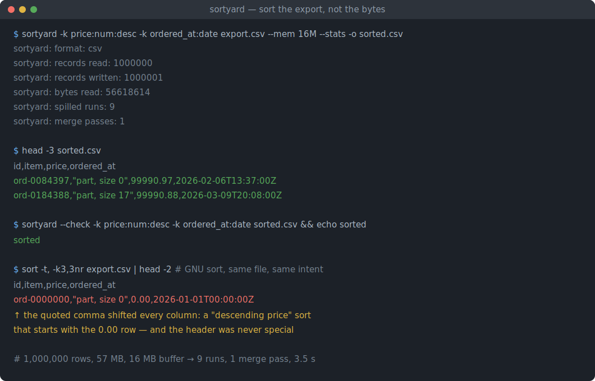
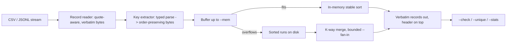

# sortyard

[English](README.md) | [中文](README.zh.md) | [日本語](README.ja.md)

[](LICENSE) [](Cargo.toml)  [](CONTRIBUTING.md)

**RAM を超える CSV/JSONL のためのオープンソース外部マージソート——型付き複数キー（数値・日付・ネスト JSON パス）、クォート安全・安定ソート、依存ゼロの Rust バイナリ。**



```bash
git clone https://github.com/JaydenCJ/sortyard.git && cargo install --path sortyard
```

## なぜ sortyard？

`sort -t, -k3 -n` は CSV を第 3 列でソートしているように見えます——クォート内のフィールドにカンマが現れて全列が静かにずれるまで、あるいはクォート内の改行が 1 レコードを 2 つに裂くまでは。GNU sort が比較するのはバイトだけ。CSV レコードや JSON キーが何かを知らず、どの数値モードも `"2026-07-01T09:00+09:00"` を時系列として解釈できません。よくある逃げ道は、ORDER BY を 1 回走らせるためだけにエクスポートを SQLite や Postgres に流し込むこと。sortyard はその隙間を埋めます：任意サイズの CSV/JSONL をストリーム処理し（`--mem` を超えたらソート済みランをディスクへ退避）、型付き複数キー——数値は大きさ、ISO 8601 日付は時刻、ネスト JSON のドットパス——でソートし、各レコードをバイト単位でそのまま出力。ヘッダは先頭、同キーは安定です。

|  | sortyard | GNU sort | xsv/qsv sort | Miller (mlr) |
|---|---|---|---|---|
| クォート付き CSV（カンマ・改行・`""`） | 安全、レコードは原文のまま | 壊れる | 安全だがクォートを書き換え | 安全だが再シリアライズ |
| JSONL キー | ネストしたドットパス（`user.id`、`items.0.sku`） | 不可 | 不可 | フラット化フィールド |
| 型付きキー | キーごとに `str`/`num`/`date` + `desc`/`ci` | キーごとの `-n`、他はバイト | 数値かバイト | 数値/文字列 |
| 日付・時刻キー | UTC オフセット対応の ISO 8601 | 不可 | 不可 | strptime、メモリ内のみ |
| RAM 超えの入力 | ディスク退避マージ、`--fan-in` で有界 | 可 | メモリ内のみ（qsv：一部対応） | メモリ内のみ |
| 安定 + `--unique` + `--check` | 三つとも対応 | `-s`/`-u`/`-c` | 検証モードなし | 検証モードなし |
| ランタイム依存 | ゼロ（std のみ） | — | — | — |

## 特徴

- **書いたとおりに並ぶ型付きキー** —— `-k price:num:desc -k ordered_at:date` なら 9.5 は 80 の下、`+09:00` のタイムスタンプは実際の時刻順。各キーは一度だけ解析され順序保存バイト列に正規化、以降はすべて `memcmp` 一発。
- **クォート安全な CSV、出力は原文** —— レコードは複数行にまたがれます（クォート内改行・`""` エスケープ・埋め込み区切り文字）。出力はバイト単位で同一、位置が変わるだけ。ヘッダは常に先頭。`-d` で区切り文字指定、`.tsv` はタブ既定、`--no-header` で列番号キーに。
- **JSONL キーはドットパス** —— `user.address.city`、`items.0.sku`。厳格な std のみの JSON パーサ（サロゲートペア・深さガード）が支え、不正な行はどこかへ紛れず行番号付きで即座に失敗します。
- **RAM 超えを前提に設計** —— レコードは `--mem`（既定 256M）までバッファし、ソート済みランとして退避、有界 `--fan-in` の k 路マージで統合。テストスイートは「退避計画は出力を変えず、作り方だけを変える」ことを直接検証します。
- **欠損値はポリシーであって事故ではない** —— 空の CSV フィールド、欠けた列、JSON `null` は `--missing first|last` で配置。`--lenient` は解析不能な値を欠損に格下げ。それ以外はレコードと行番号を示すハードエラー。
- **検証器を内蔵** —— `--check` はファイルが指定キー順かを確認（終了コード 0/1、GNU sort 流）、`--unique` はキーごとに先頭レコードを残し、`--stats` はレコード数・退避ラン数・マージ回数を報告。

## クイックスタート

インストール（Rust 1.75+ が必要。crates.io には未公開のためソースからビルド）：

```bash
git clone https://github.com/JaydenCJ/sortyard.git && cargo install --path sortyard
```

同梱サンプルを価格順（高い順）にソート：

```bash
sortyard -k price:num:desc examples/orders.csv
```

出力（実際の実行——クォート内のカンマと `""` が無傷な点に注目）：

```text
id,item,price,qty,ordered_at
A-1001,Girder,1200,3,2026-06-27
A-1005,Beam,780.00,8,2026-06-29
A-1003,"Steel plate 4x8",412.50,12,2026-06-28T09:15:00+02:00
A-1004,"Angle bracket, 90°",2.75,640,
A-1007,"Hex bolt, M8",0.35,4000,2026-06-30T16:45:00Z
A-1002,Rivet,0.12,25000,2026-06-27T23:30:00-05:00
A-1006,"Washer ""wide""",0.08,9500,2026-06-30T16:44:59Z
```

同じエンジンで 57 MB・100 万行のエクスポートを、あえて極小バッファで処理し、その後検証：

```bash
sortyard -k price:num:desc -k ordered_at:date export.csv --mem 16M --stats -o sorted.csv
sortyard --check -k price:num:desc -k ordered_at:date sorted.csv && echo sorted
```

```text
sortyard: format:          csv
sortyard: records read:    1000000
sortyard: records written: 1000001
sortyard: bytes read:      56618614
sortyard: spilled runs:    9
sortyard: merge passes:    1
sorted
```

JSONL も同じ使い方で、ドットパスを指定するだけ：`sortyard -k user.plan -k ts:date events.jsonl`。詳しくは [examples/](examples/README.md) を。

## キー指定

キーは `field[:type][:flag...]` と書きます——完全な意味論は [docs/keys.md](docs/keys.md)。

| 部分 | 値 | 意味 |
|---|---|---|
| `field` | ヘッダ名、1 始まりの列番号、または JSON ドットパス | ソートの基準；後続の `-k` キーがタイブレーク |
| type | `str`（既定）、`num`、`date` | バイト順、数値の大きさ、または ISO 8601 の時刻（オフセットは UTC に正規化） |
| flags | `desc`、`asc`、`ci` | キーごとの方向；`ci` は `str` キーの ASCII 大文字小文字を同一視 |

## オプション

| キー | 既定 | 効果 |
|---|---|---|
| `-f, --format` | `auto` | `csv` か `jsonl`；拡張子、次いで先頭バイトで自動判定 |
| `-d, --delimiter` | `,`（`.tsv` は `\t`） | CSV フィールド区切り文字 |
| `--no-header` | オフ | ヘッダなし CSV；キーは 1 始まりの列番号 |
| `--missing` | `last` | キー欠損レコードの位置（`first`/`last`） |
| `--lenient` | オフ | 解析不能なキー値をエラーではなく欠損として扱う |
| `--mem` | `256M` | ソート済みランをディスクへ退避する前のバッファ量 |
| `--fan-in` | `64` | 1 パスでマージする最大ラン数（≥ 2）；小さいほどパス増・オープンファイル減 |
| `--tmp` | システム一時領域 | 退避ディレクトリ（実行ごとに作成、終了時に削除） |
| `-u` / `-r` / `-c` | オフ | キー重複除去 / 全順序の反転 / 検証モード |

## アーキテクチャ



## ロードマップ

- [x] コアエンジン：クォート安全な CSV + JSONL リーダ、型付きキー符号化（`str`/`num`/`date`、`desc`/`ci`）、ディスク退避ラン、有界ファンインの多パスマージ、安定順序、`--unique`、`--check`、`--missing`、`--lenient`、`--stats`
- [ ] JSON キーパスでのドットのエスケープ（`a\.b`）とクォート付き CSV ヘッダ選択子
- [ ] ランのソートとマージのスレッド並列化
- [ ] gzip/zstd 入力の透過読み込み（現状：`zcat`/`zstdcat` からパイプ）
- [ ] 自然順・バージョン順（`v1.9` の次に `v1.10`）を第 4 のキー型として

全リストは [open issues](https://github.com/JaydenCJ/sortyard/issues) へ。

## コントリビュート

コントリビュート歓迎です——[CONTRIBUTING.md](CONTRIBUTING.md) を参照し、[good first issue](https://github.com/JaydenCJ/sortyard/issues?q=is%3Aissue+is%3Aopen+label%3A%22good+first+issue%22) から始めるか、[discussion](https://github.com/JaydenCJ/sortyard/discussions) を立ててください。本リポジトリは CI を同梱しません。上記の主張はすべて、ローカルでの `cargo test`（90 テスト）と `scripts/smoke.sh`（`SMOKE OK` を表示すること）の実行で検証されています。

## ライセンス

[MIT](LICENSE)
