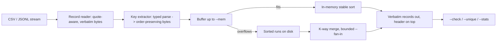

# sortyard

[English](README.md) | [中文](README.zh.md) | [日本語](README.ja.md)

[](LICENSE) [](Cargo.toml)  [](CONTRIBUTING.md)

**Open-source external merge sort for CSV/JSONL bigger than RAM — typed multi-column keys (numbers, dates, nested JSON paths), quote-safe and stable, in a zero-dependency Rust binary.**


```bash
git clone https://github.com/JaydenCJ/sortyard.git && cargo install --path sortyard
```

## Why sortyard?

`sort -t, -k3 -n` looks like it sorts a CSV by its third column — until a quoted field contains a comma and every column silently shifts, or a quoted newline splits one record into two. GNU sort compares bytes; it has no idea what a CSV record or a JSON key is, and no numeric mode will parse `"2026-07-01T09:00+09:00"` chronologically. The usual escape hatch is loading the export into SQLite or Postgres just to run one ORDER BY. sortyard is that missing middle: it streams CSV/JSONL of any size (spilling sorted runs to disk past `--mem`), sorts on typed multi-column keys — numbers by magnitude, ISO 8601 dates by instant, nested JSON dot paths — and re-emits every record byte-for-byte verbatim, header on top, stable for equal keys.

|  | sortyard | GNU sort | xsv/qsv sort | Miller (mlr) |
|---|---|---|---|---|
| Quoted CSV (commas, newlines, `""`) | safe, records verbatim | mangled | safe, but rewrites quoting | safe, but re-serializes |
| JSONL keys | nested dot paths (`user.id`, `items.0.sku`) | no | no | flattened fields |
| Typed keys | per-key `str`/`num`/`date` + `desc`/`ci` | per-key `-n`, bytes for the rest | numeric or bytes | numeric/string |
| Date/time keys | ISO 8601 with UTC offsets | no | no | strptime, in-memory |
| Bigger than RAM | spill-to-disk merge, bounded `--fan-in` | yes | in-memory (qsv: partial) | in-memory |
| Stable + `--unique` + `--check` | yes, all three | `-s`/`-u`/`-c` | no check mode | no check mode |
| Runtime dependencies | none (std-only) | — | — | — |

## Features

- **Typed keys that mean what they say** — `-k price:num:desc -k ordered_at:date` sorts 9.5 below 80 and `+09:00` timestamps by actual instant; each key is parsed once into an order-preserving byte string, then everything downstream is a plain `memcmp`.
- **Quote-safe CSV, verbatim out** — records may span lines (quoted newlines, `""` escapes, embedded delimiters) and come back byte-identical, only reordered; the header stays on top. Custom delimiters via `-d`, `.tsv` implies tab, `--no-header` switches keys to column numbers.
- **JSONL keys as dot paths** — `user.address.city`, `items.0.sku`; backed by a strict std-only JSON parser (surrogate pairs, depth guard) so a malformed line fails loudly with its line number instead of sorting somewhere random.
- **Bigger than RAM by design** — records buffer up to `--mem` (default 256M), spill as sorted runs, and k-way merge with bounded `--fan-in`; the test suite asserts the spill plan never changes the output, only how it is produced.
- **Missing values are a policy, not a surprise** — empty CSV fields, absent columns and JSON `null` sort `--missing first|last`; `--lenient` downgrades unparseable values to missing; everything else is a hard error naming the record and line.
- **A verifier built in** — `--check` confirms a file is ordered by your keys (exit 0/1, GNU-sort style), `--unique` keeps the first record per key, `--stats` reports records, spilled runs and merge passes.

## Quickstart

Install (requires Rust 1.75+; not on crates.io yet, so build from source):

```bash
git clone https://github.com/JaydenCJ/sortyard.git && cargo install --path sortyard
```

Sort the bundled example by price, most expensive first:

```bash
sortyard -k price:num:desc examples/orders.csv
```

Output (real run — note the quoted commas and `""` survive untouched):

```text
id,item,price,qty,ordered_at
A-1001,Girder,1200,3,2026-06-27
A-1005,Beam,780.00,8,2026-06-29
A-1003,"Steel plate 4x8",412.50,12,2026-06-28T09:15:00+02:00
A-1004,"Angle bracket, 90°",2.75,640,
A-1007,"Hex bolt, M8",0.35,4000,2026-06-30T16:45:00Z
A-1002,Rivet,0.12,25000,2026-06-27T23:30:00-05:00
A-1006,"Washer ""wide""",0.08,9500,2026-06-30T16:44:59Z
```

The same engine on a 57 MB, million-row export with a deliberately tiny buffer, then verified:

```bash
sortyard -k price:num:desc -k ordered_at:date export.csv --mem 16M --stats -o sorted.csv
sortyard --check -k price:num:desc -k ordered_at:date sorted.csv && echo sorted
```

```text
sortyard: format:          csv
sortyard: records read:    1000000
sortyard: records written: 1000001
sortyard: bytes read:      56618614
sortyard: spilled runs:    9
sortyard: merge passes:    1
sorted
```

JSONL works the same way, with dot paths: `sortyard -k user.plan -k ts:date events.jsonl`. See [examples/](examples/README.md) for more.

## Key specs

A key is `field[:type][:flag...]` — full semantics in [docs/keys.md](docs/keys.md).

| Part | Values | Meaning |
|---|---|---|
| `field` | header name, 1-based column, or JSON dot path | what to sort by; later `-k` keys break ties |
| type | `str` (default), `num`, `date` | bytes, numeric magnitude, or ISO 8601 instant (offsets normalized to UTC) |
| flags | `desc`, `asc`, `ci` | per-key direction; `ci` folds ASCII case on `str` keys |

## Options

| Key | Default | Effect |
|---|---|---|
| `-f, --format` | `auto` | `csv` or `jsonl`; auto-detects by extension, then first content byte |
| `-d, --delimiter` | `,` (`\t` for `.tsv`) | CSV field delimiter |
| `--no-header` | off | headerless CSV; keys are 1-based column numbers |
| `--missing` | `last` | where records with a missing key sort (`first`/`last`) |
| `--lenient` | off | unparseable key values become missing instead of errors |
| `--mem` | `256M` | buffer size before spilling a sorted run to disk |
| `--fan-in` | `64` | max runs merged per pass (≥ 2); lower means more passes, fewer open files |
| `--tmp` | system temp | spill directory (created per run, removed on exit) |
| `-u` / `-r` / `-c` | off | unique by key / reverse the total order / check mode |

## Architecture



## Roadmap

- [x] Core engine: quote-safe CSV + JSONL readers, typed key encoding (`str`/`num`/`date`, `desc`/`ci`), spill-to-disk runs, bounded-fan-in multi-pass merge, stable order, `--unique`, `--check`, `--missing`, `--lenient`, `--stats`
- [ ] Escapable dots in JSON key paths (`a\.b`) and quoted CSV header selectors
- [ ] Parallel run sorting and merging across threads
- [ ] gzip/zstd input transparently (today: pipe from `zcat`/`zstdcat`)
- [ ] Natural/version ordering (`v1.10` after `v1.9`) as a fourth key type

See the [open issues](https://github.com/JaydenCJ/sortyard/issues) for the full list.

## Contributing

Contributions are welcome — see [CONTRIBUTING.md](CONTRIBUTING.md), start with a [good first issue](https://github.com/JaydenCJ/sortyard/issues?q=is%3Aissue+is%3Aopen+label%3A%22good+first+issue%22) or open a [discussion](https://github.com/JaydenCJ/sortyard/discussions). This repository ships no CI; every claim above is verified by local runs of `cargo test` (90 tests) and `scripts/smoke.sh` (must print `SMOKE OK`).

## License

[MIT](LICENSE)
