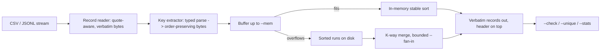

# sortyard

[English](README.md) | [中文](README.zh.md) | [日本語](README.ja.md)

[](LICENSE) [](Cargo.toml)  [](CONTRIBUTING.md)

**开源的 CSV/JSONL 外部归并排序，专治超出内存的大文件——类型化多列键（数字、日期、嵌套 JSON 路径），引号安全、稳定排序，零依赖 Rust 二进制。**


```bash
git clone https://github.com/JaydenCJ/sortyard.git && cargo install --path sortyard
```

## 为什么选 sortyard？

`sort -t, -k3 -n` 看上去是在按第三列排序 CSV——直到某个带引号的字段里出现逗号，所有列悄悄错位，或者引号内的换行把一条记录劈成两条。GNU sort 只比较字节；它不懂什么是 CSV 记录、什么是 JSON 键，任何数字模式也无法把 `"2026-07-01T09:00+09:00"` 按时间先后解析。常见的逃生通道是把导出文件灌进 SQLite 或 Postgres，只为跑一条 ORDER BY。sortyard 补上了这个缺口：它流式处理任意大小的 CSV/JSONL（超过 `--mem` 就把有序段落溢写到磁盘），按类型化多列键排序——数字按大小、ISO 8601 日期按时刻、嵌套 JSON 点路径——并把每条记录逐字节原样输出，表头置顶，相等键保持稳定。

|  | sortyard | GNU sort | xsv/qsv sort | Miller (mlr) |
|---|---|---|---|---|
| 带引号 CSV（逗号、换行、`""`） | 安全，记录原样输出 | 会损坏 | 安全，但会重写引号 | 安全，但会重新序列化 |
| JSONL 键 | 嵌套点路径（`user.id`、`items.0.sku`） | 不支持 | 不支持 | 展平字段 |
| 类型化键 | 每键 `str`/`num`/`date` + `desc`/`ci` | 每键 `-n`，其余按字节 | 数字或字节 | 数字/字符串 |
| 日期/时间键 | ISO 8601，支持 UTC 偏移 | 不支持 | 不支持 | strptime，仅内存内 |
| 超出内存 | 溢写磁盘归并，`--fan-in` 有界 | 支持 | 仅内存（qsv：部分支持） | 仅内存 |
| 稳定 + `--unique` + `--check` | 三者齐备 | `-s`/`-u`/`-c` | 无校验模式 | 无校验模式 |
| 运行时依赖 | 零（仅标准库） | — | — | — |

## 特性

- **类型化键，所见即所排** —— `-k price:num:desc -k ordered_at:date` 让 9.5 排在 80 之下、`+09:00` 时间戳按真实时刻排序；每个键只解析一次，规整成保序字节串，此后全程只做 `memcmp`。
- **引号安全的 CSV，原样输出** —— 记录可以跨行（引号内换行、`""` 转义、内嵌分隔符），输出逐字节一致，只是换了位置；表头始终置顶。`-d` 自定义分隔符，`.tsv` 默认制表符，`--no-header` 切换为列号键。
- **JSONL 键即点路径** —— `user.address.city`、`items.0.sku`；背后是严格的纯标准库 JSON 解析器（代理对、深度防护），畸形行会带着行号大声报错，而不是被排到随机位置。
- **为超内存场景而生** —— 记录先缓冲到 `--mem`（默认 256M），溢写为有序段落，再以有界 `--fan-in` 做 k 路归并；测试套件直接断言溢写方案永不改变输出，只改变产出方式。
- **缺失值是策略，不是意外** —— 空 CSV 字段、缺失列和 JSON `null` 按 `--missing first|last` 排位；`--lenient` 把无法解析的值降级为缺失；其余一律硬报错，指明记录与行号。
- **自带校验器** —— `--check` 确认文件已按你的键有序（退出码 0/1，GNU sort 风格），`--unique` 按键保留首条记录，`--stats` 报告记录数、溢写段落数与归并趟数。

## 快速上手

安装（需要 Rust 1.75+；尚未发布到 crates.io，请从源码构建）：

```bash
git clone https://github.com/JaydenCJ/sortyard.git && cargo install --path sortyard
```

把内置示例按价格排序，最贵的在前：

```bash
sortyard -k price:num:desc examples/orders.csv
```

输出（真实运行——注意引号内的逗号和 `""` 原封不动）：

```text
id,item,price,qty,ordered_at
A-1001,Girder,1200,3,2026-06-27
A-1005,Beam,780.00,8,2026-06-29
A-1003,"Steel plate 4x8",412.50,12,2026-06-28T09:15:00+02:00
A-1004,"Angle bracket, 90°",2.75,640,
A-1007,"Hex bolt, M8",0.35,4000,2026-06-30T16:45:00Z
A-1002,Rivet,0.12,25000,2026-06-27T23:30:00-05:00
A-1006,"Washer ""wide""",0.08,9500,2026-06-30T16:44:59Z
```

同一引擎处理 57 MB、百万行的导出文件，故意用极小缓冲，随后校验：

```bash
sortyard -k price:num:desc -k ordered_at:date export.csv --mem 16M --stats -o sorted.csv
sortyard --check -k price:num:desc -k ordered_at:date sorted.csv && echo sorted
```

```text
sortyard: format:          csv
sortyard: records read:    1000000
sortyard: records written: 1000001
sortyard: bytes read:      56618614
sortyard: spilled runs:    9
sortyard: merge passes:    1
sorted
```

JSONL 的用法完全相同，用点路径即可：`sortyard -k user.plan -k ts:date events.jsonl`。更多见 [examples/](examples/README.md)。

## 键规格

一个键写作 `field[:type][:flag...]`——完整语义见 [docs/keys.md](docs/keys.md)。

| 部分 | 取值 | 含义 |
|---|---|---|
| `field` | 表头名、1 起列号或 JSON 点路径 | 排序依据；后续 `-k` 键用于打破平局 |
| type | `str`（默认）、`num`、`date` | 按字节、按数值大小或按 ISO 8601 时刻（偏移归一到 UTC） |
| flags | `desc`、`asc`、`ci` | 每键方向；`ci` 对 `str` 键折叠 ASCII 大小写 |

## 选项

| 键 | 默认 | 效果 |
|---|---|---|
| `-f, --format` | `auto` | `csv` 或 `jsonl`；先按扩展名、再按首个内容字节自动判定 |
| `-d, --delimiter` | `,`（`.tsv` 为 `\t`） | CSV 字段分隔符 |
| `--no-header` | 关 | 无表头 CSV；键为 1 起列号 |
| `--missing` | `last` | 键缺失的记录排在哪里（`first`/`last`） |
| `--lenient` | 关 | 无法解析的键值按缺失处理而非报错 |
| `--mem` | `256M` | 溢写有序段落到磁盘前的缓冲大小 |
| `--fan-in` | `64` | 每趟归并的最大段落数（≥ 2）；越小趟数越多、打开文件越少 |
| `--tmp` | 系统临时目录 | 溢写目录（每次运行创建，退出时删除） |
| `-u` / `-r` / `-c` | 关 | 按键去重 / 反转全序 / 校验模式 |

## 架构



## 路线图

- [x] 核心引擎：引号安全的 CSV + JSONL 读取器、类型化键编码（`str`/`num`/`date`、`desc`/`ci`）、溢写磁盘段落、有界扇入多趟归并、稳定排序、`--unique`、`--check`、`--missing`、`--lenient`、`--stats`
- [ ] JSON 键路径中可转义的点（`a\.b`）以及带引号的 CSV 表头选择器
- [ ] 段落排序与归并的多线程并行化
- [ ] 透明读取 gzip/zstd 输入（目前：从 `zcat`/`zstdcat` 管道输入）
- [ ] 自然/版本号排序（`v1.10` 排在 `v1.9` 之后）作为第四种键类型

完整列表见 [open issues](https://github.com/JaydenCJ/sortyard/issues)。

## 参与贡献

欢迎贡献——请看 [CONTRIBUTING.md](CONTRIBUTING.md)，可从 [good first issue](https://github.com/JaydenCJ/sortyard/issues?q=is%3Aissue+is%3Aopen+label%3A%22good+first+issue%22) 入手，或发起一个 [discussion](https://github.com/JaydenCJ/sortyard/discussions)。本仓库不附带 CI；上文每一条主张都由本地运行 `cargo test`（90 个测试）与 `scripts/smoke.sh`（必须打印 `SMOKE OK`）验证。

## 许可证

[MIT](LICENSE)
